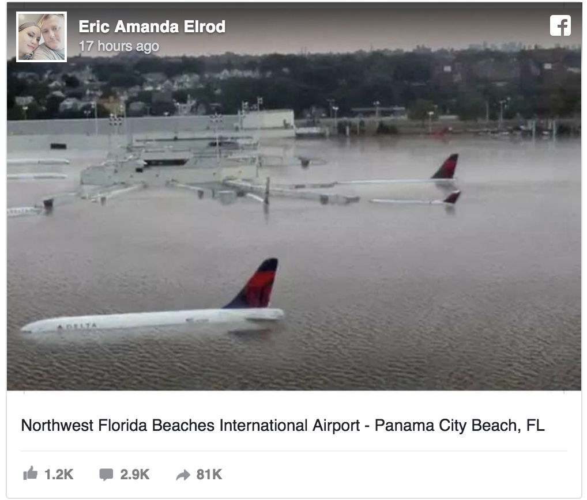

## What is bullshit?

**_For this project, I defined Bullshit as any form of presentation or statement, intended to persuade and convert the audience into believers to spread illogical ideas or misinformation into the world._**

It can come in many forms, whether it's an advertisement on the local newspaper talking about mens health, or a 200 character tweet on Twitter about climate change, or your roommate bullshitting you about what is the "proper" rhythm to a song.

### How did I gather this data?

Every day for a week, I tried to keep my eyes peeled bullshit I produced or was exposed. Once observed, I'd quickly go on my phone for a quick minute and type my observations on a Google Sheets document. My goal was to be bullshit neutral in my day-to-day life: producing just as much bullshit that I encountered. According to this data set, I seemingly produced less bullshit than other sources (online or in the news), but I think there's always room for improvement. There were many more data points I may have not utilized, simply being that I tried to be as picky to bullshit as I could. Minor mistakes by someone or some press were not counted. A viral Facebook post claiming an entire airport was submerged in water during Hurricane Michael, when in reality, the photos were 5 year old theoretical images posted in a Climate Change forum absolutely do count.

### Visualizations

 
 
 

### Observations

1. My original prediction that my roommate would have the smallest amount of bullshit emitted was correct. After all, I had a definite conclusion before starting that project that I emitted tons more bullshit than him on daily basis. Mostly due to the fact that I often speak before actually thinking through what I'm going to say. 

2. Bullshit I found online and not from a specific news source often was the most controversial and most common misinformation that I encountered. Viral posts on Facebook or Twitter were prevalent all over my "feeds". These BS creators purposely made emotionally convincing posts (from _"real life experiences"_, or by _"citing scientists"_) that seemed credible and factual, but ultimately they were either false or true but warped in a way to make it seem like new information.

### Bullshit Award

- Thousands of Facebook users have liked and commented while tens of thousands have shared this photo depicting an airport in Florida flooding due to Hurricane Michael. What the majority of these Facebook users realize is that this picture was actually a digitally edited photo by artist Nikolay Lamm posted on [Climate Central](http://www.climatecentral.org/news/coastal-us-airports-face-increasing-threat-from-sea-level-rise-16126) in 2013 with the caption:

> What LaGuardia [New York] could look like at high tide with 25 feet of sea level rise, an amount that would require a worst-case scenario involving melting of large parts of Greenland and Antarctica

This bullshit was debunked by [Spokes.](https://www.snopes.com/fact-check/florida-airport-flooded-michael/)
