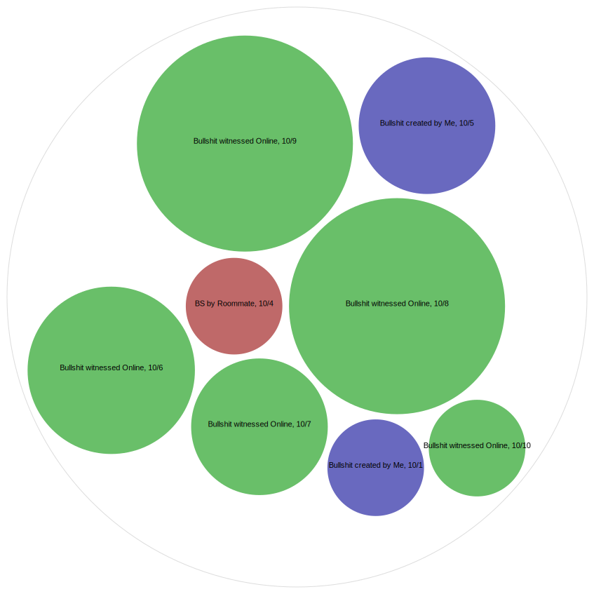
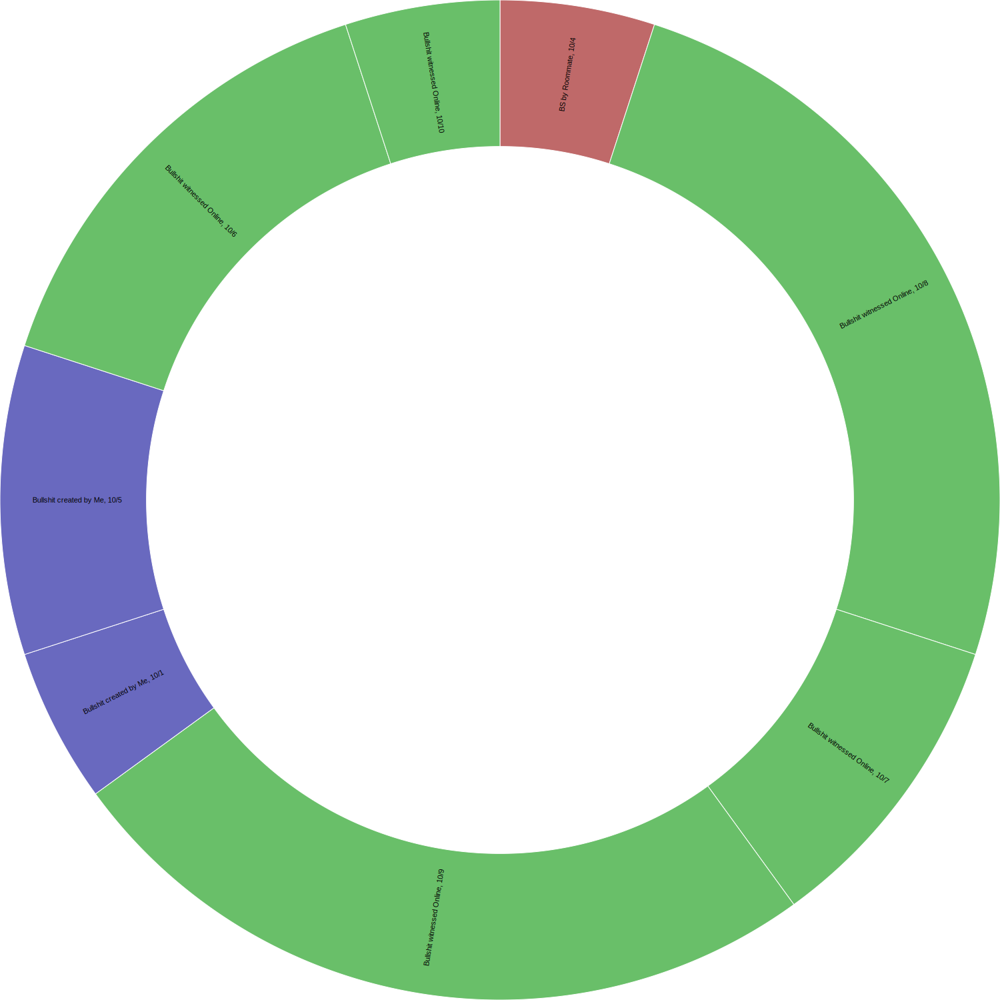

## What is bullshit?
_**Bullshit, in my project definition, is language, statistical figures, data graphics, and other forms of presentation intended to persuade by impressing and overwhelming a reader or listener, with a blatant disregard for truth and logical coherence**._

### How did I gather this data?

Every day for a week, I tried to keep my eyes peeled bullshit I produced or was exposed. Once observed, I'd quickly go on my phone for a quick minute and type my observations on a Google Sheets document. My goal was to be bullshit neutral in my day-to-day life: producing just as much bullshit that I encountered. According to this data set, I seemingly produced less bullshit than other sources (online or in the news), but I think there's always room for improvement.

### Visualizations

 
 
 

### Observations

1. My original prediction that my roommate would have the smallest amount of bullshit emitted was correct. After all, I had a definite conclusion before starting that project that I emitted tons more bullshit than him on daily basis. Mostly due to the fact that I often speak before actually thinking through what I'm going to say. 

2. Bullshit I found online and not from a specific news source often was the most controversial and most common misinformation that I encountered. Viral posts on Facebook or Twitter were prevalent all over my "feeds". These BS creators purposely made emotionally convincing posts (from _"real life experiences"_, or by _"citing scientists"_) that seemed credible and factual, but ultimately they were either false or true but warped in a way to make it seem like new information.

